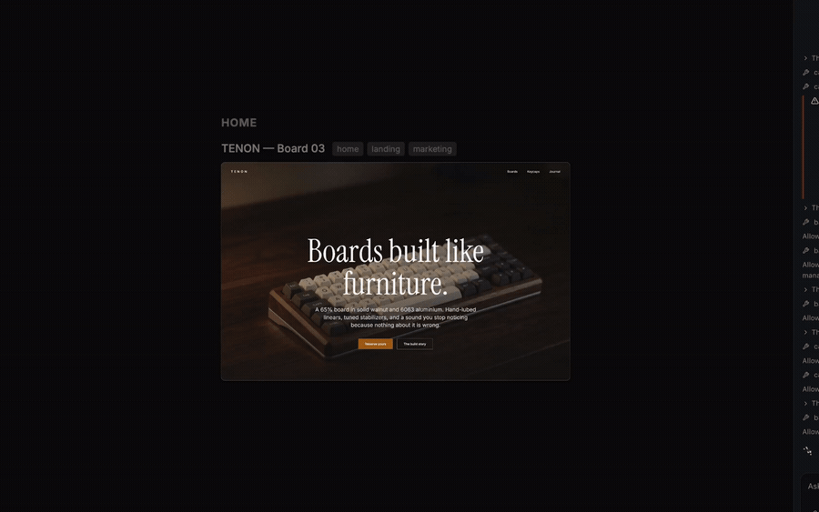
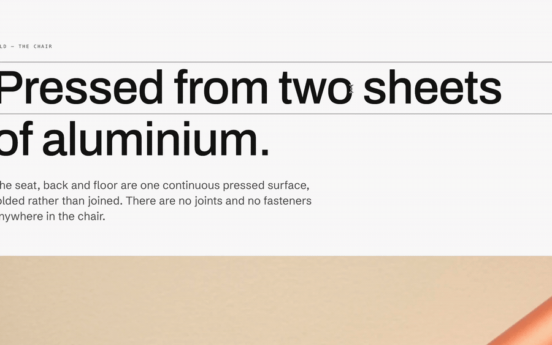
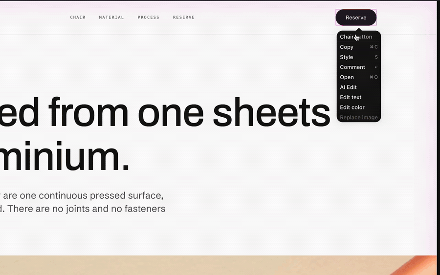
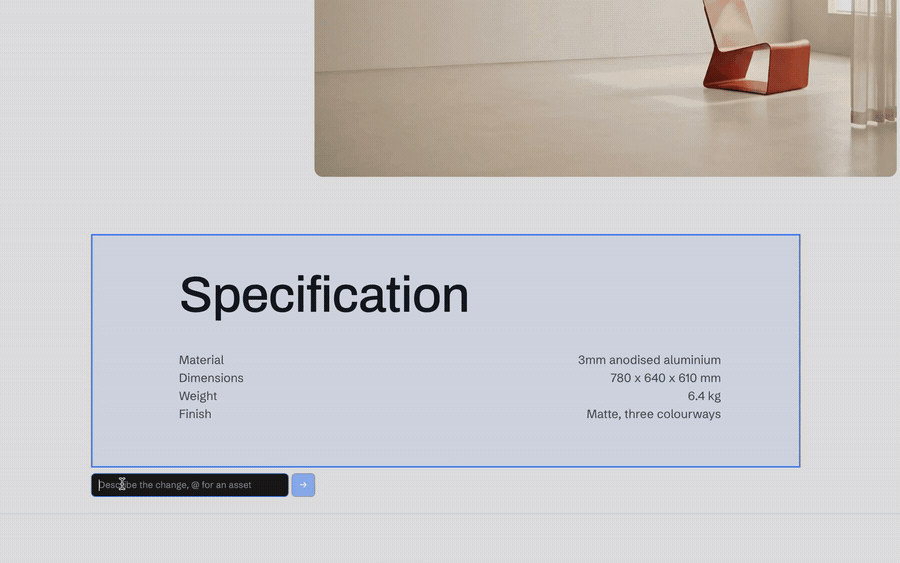
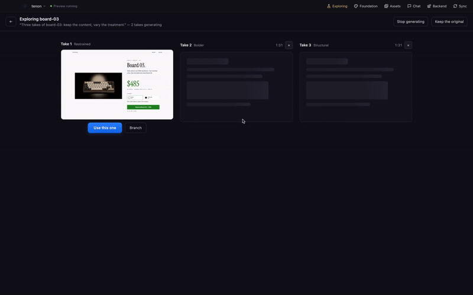
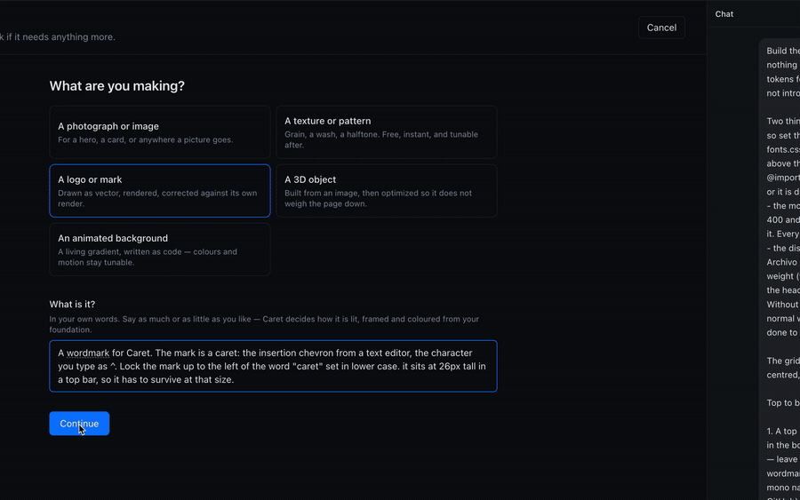
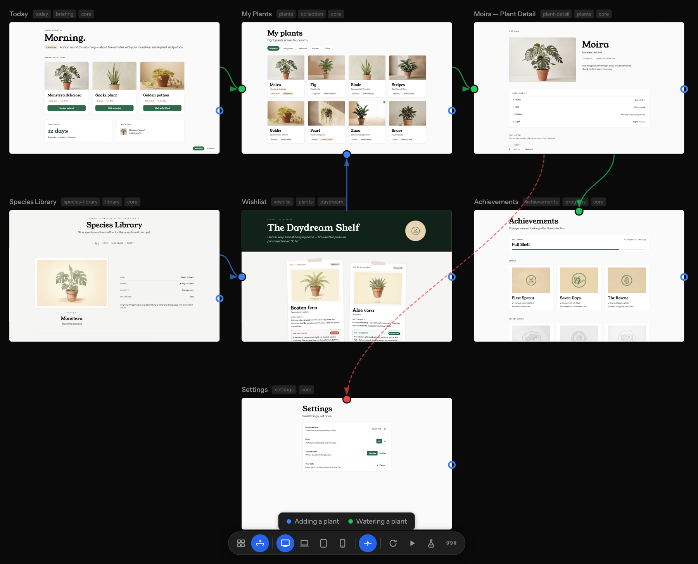

<div align="center">
  <h1>Caret</h1>
  <p><strong>A design canvas over your real code.</strong></p>
  <p>
    <a href="https://github.com/precious112/caret-desktop/releases/latest"></a>
    
    
    <a href="LICENSE"></a>
  </p>
</div>

https://github.com/user-attachments/assets/93e273d4-aed3-45cd-bb5e-c5b587691017

> You see your app as pages on a canvas. You click a headline and retype it. You
> right-click a colour and pick a new one. The change is written straight into
> your source files, because the canvas was never a picture of your app. It was
> your app all along.
>
> Every other AI design tool gets one shot. It builds you a screen, you fix the
> same three things by hand, and next time it makes those same three mistakes
> again. Caret keeps the design in your repo, as files, in git. Fix something
> once and it stays fixed, because the fix is a file that is still there
> tomorrow.
>
> It is for people who ship the front end: **designers who have moved into code,
> and engineers who would rather design where they already work.**

> Caret is free and runs on your machine. No account, no key needed to open it
> and start designing. This repo holds the **source**; the **downloads** live at
> [precious112/caret-desktop](https://github.com/precious112/caret-desktop).

---

## Download

Links always point at the newest release.

| Platform | Download |
|----------|----------|
| **macOS**, Apple Silicon (M1/M2/M3…) | [Caret-macOS-arm64.zip](https://github.com/precious112/caret-desktop/releases/latest/download/Caret-macOS-arm64.zip) |
| **macOS**, Intel | [Caret-macOS-x64.zip](https://github.com/precious112/caret-desktop/releases/latest/download/Caret-macOS-x64.zip) |
| **Windows**, installer (recommended) | [Caret-Windows-Setup-x64.exe](https://github.com/precious112/caret-desktop/releases/latest/download/Caret-Windows-Setup-x64.exe) |
| **Windows**, Arm installer | [Caret-Windows-Setup-arm64.exe](https://github.com/precious112/caret-desktop/releases/latest/download/Caret-Windows-Setup-arm64.exe) |
| **Windows**, portable | [Caret-Windows-Portable-x64.exe](https://github.com/precious112/caret-desktop/releases/latest/download/Caret-Windows-Portable-x64.exe) |
| **Linux**, Debian/Ubuntu | [Caret-Linux-x64.deb](https://github.com/precious112/caret-desktop/releases/latest/download/Caret-Linux-x64.deb) |
| **Linux**, Fedora/RHEL | [Caret-Linux-x64.rpm](https://github.com/precious112/caret-desktop/releases/latest/download/Caret-Linux-x64.rpm) |
| **Linux**, AppImage (portable) | [Caret-Linux-x64.AppImage](https://github.com/precious112/caret-desktop/releases/latest/download/Caret-Linux-x64.AppImage) |

## ⚠️ Windows and Linux builds are not signed yet, here is how to open them

Code-signing certificates run **$99–$500/yr**, so Windows and Linux builds are
unsigned for now. **The apps are safe.** Your OS just shows a one-time warning
because it cannot see a signature. A single terminal command is the most
reliable way past it, more dependable than clicking through the dialogs.

### 🪟 Windows

Open **PowerShell** and unblock the file, then run the installer normally. This
removes the "Mark of the Web" that triggers SmartScreen.

```powershell
Unblock-File "$HOME\Downloads\Caret-Windows-Setup-x64.exe"
```

> Using the portable exe instead? Unblock that one the same way.

### 🐧 Linux

No signing needed:

```bash
sudo dpkg -i Caret-Linux-x64.deb      # Debian/Ubuntu
sudo rpm -i  Caret-Linux-x64.rpm      # Fedora/RHEL
chmod +x Caret-Linux-x64.AppImage && ./Caret-Linux-x64.AppImage   # portable
```

---

## Your first project

1. **Open a folder.** Caret creates a `.caret/` folder inside it. Nothing else
   in your project is touched.
2. **Say what you are building**, in a sentence or two. "A booking site for a
   small climbing gym" is plenty.
3. **Choose how much you want to decide yourself.** Caret can interview you
   about colour, type and spacing, which needs a model connected. Or you can set
   them by hand, which needs nothing at all.
4. **You end up with a foundation**: a brand colour and a full scale built from
   it, a typeface, a spacing step, a corner radius. Saved in
   `.caret/tokens/foundation.json`, and used by everything you make afterwards.
5. **Now make pages.** Ask for one in the chat, or write the file yourself. It
   appears on the canvas either way.

## How it works

Caret splits the front end of your project into two layers that live in the same
repo.

**The design layer** sits in a folder called `.caret/`. Pages go in
`.caret/pages/`, reusable pieces in `.caret/components/`, the journeys between
pages in `.caret/flows/`, and your design tokens in `.caret/tokens/`. Tokens are
just your colours, type sizes and spacing, written down once. It is all real
React, so it is all reviewable in a pull request. This is your workshop, where
you work things out.

**Your app layer** is what you actually ship, in any framework: Next.js, Svelte,
Vue, plain HTML. Caret has no opinion about it.

You design in the first, then sync into the second. Keeping them apart is what
makes everything below work. Caret knows exactly how the design layer is shaped,
so it can render it, let you click it, and translate it, no matter what your
shipped app is written in.

### A live canvas

Every page renders on a canvas you can zoom and pan, so you can see the whole
product at once. These are not screenshots. Click a page and it becomes live, so
you can hover things, open menus and type into forms. Switch between desktop,
tablet and phone to check a page holds up.

<p align="center">
  
</p>

### Edit what you can see

Right-click any piece of text, any colour, or any image and change it right
there. No properties panel to hunt through. You edit the thing you were already
looking at, Caret writes it into the real source file, and the page reloads on
its own.

Edits land on the element you actually clicked, not one the model guessed at.
Caret gives every element a stable id and edits the source tree directly, so
clicking the third card in a list changes the third card.

<p align="center">
  
</p>

Colours work the same way with one extra step that saves a lot of mess. When you
pick a colour, Caret checks whether it is close to one of your design tokens. If
it is, it uses the token instead of pasting a raw hex code in. Change your brand
colour later and every place that used it changes too.

<p align="center">
  
</p>

You can also drag an edge to resize something, and the new size lands in the
code rather than in a style panel you have to remember to keep in step.

### Describe the harder changes

Some changes are too fiddly to click your way through. Paint over the part of the
page you mean and say what you want in plain words. Your agent receives the
exact elements you marked, so it does not have to guess which bit of the page you
were talking about.

<p align="center">
  
</p>

### Try three versions at once

When you do not know what you want yet, ask for a few. Caret builds three
versions of the page side by side, live, and you pick the one you like. The
others are thrown away and the winner becomes the page. Picking leaves an undo
step, so changing your mind costs one keystroke.

<p align="center">
  
</p>

### Make the pictures too

A design needs more than layout. It needs a logo, a background, a photograph of
the thing you are selling. Caret makes those from a sentence and puts them in
your project.

You say what the thing is. Caret decides how it is lit, framed and coloured from
the design tokens you already set, so what comes out matches the rest of your
work. You get several versions to choose from, and you can ask for changes to the
one you picked.

<p align="center">
  
</p>

It covers four kinds of thing: photographs and images, repeating textures and
patterns, logos and marks drawn as real vector files, and animated backgrounds
written as code so the colours stay adjustable afterwards.

### Flows between pages

Describe the journeys through your product as flows, and the canvas draws them
over your pages. Each flow gets its own colour, error paths show as dashed
lines, and you can see at a glance which pages a journey touches and which
pages nothing leads to.

<p align="center">
  
</p>

### Caret checks its own work

AI-written pages go wrong in boring, repeatable ways: a colour that is nearly
but not quite your brand colour, text too faint to read, a heading scale that
skips a step. Caret runs a set of checks over your design pages and shows what
it finds on the canvas without being asked, so you notice before it ships rather
than after. The checks are plain rules, not another model's opinion, and you can
turn any of them off in `.caret/checks.json`.

### Keeping your app in step

When your design changes, Caret works out exactly which design files moved since
the last sync. It hands your agent that list, then the agent reads your current
design and your current app code and makes the app match. Caret takes a snapshot
first, so undoing a sync always works.

It also works the other way. If somebody edits the app directly, the design layer
is now telling a lie about that page. Caret notices by comparing file contents
and offers to bring the design back in line. You see the app's version and your
design's version side by side and choose. Caret never quietly merges them.

### Your agent already knows your rules

Caret writes your design tokens into `AGENTS.md`, `CLAUDE.md` and
`.cursor/rules`, and keeps them current.

This matters more than it sounds. An AI told to "build me a card" that has to
*decide* to go and look up your spacing scale will not bother. It will invent
something from whatever it saw in training. Putting your colours, type and
spacing in front of it every session is the difference between a card that fits
your app and one that does not.

Caret also watches the `.caret/` folder. Your agent will edit those files with
its own tools rather than Caret's, which is fine. Caret checks and fixes up
whatever appears in there, whoever wrote it.

---

## Bring your own model

Caret drives a coding agent for the work you start inside it: an AI edit, the
paint-and-describe editor, a sync, the foundation interview.

OpenCode's engine is built in, and connects to whichever provider you want. That
can be an API key you pay per use, or a subscription you already have. ChatGPT
Plus, Pro and Go, Kimi For Coding, the Z.AI and Zhipu coding plans and GitHub
Copilot all work as providers you sign into.

Anthropic's models are the one exception. They are available by API key, not by
subscription, because Anthropic does not allow Claude subscriptions to be used
outside its own apps.

## Use Caret from your own terminal

If you already work with an agent in your terminal, Caret can let it read and
write your design layer. Caret runs a small local server per open project and
generates the exact config for your client. Claude Code and Codex are both
tested and working.

See [docs/connect-an-agent.md](docs/connect-an-agent.md).

This direction is optional. Nothing in the app needs it, and work you start
inside Caret runs on Caret's own backend instead.

## Building from source

You need Node 20 or newer.

```bash
npm install
npm run dev       # run it in development
npm run build     # build it
npm run package   # make an installer for your platform
```

Tests:

```bash
npm run test:unit             # unit tests
npm run verify:design-shell   # checks the generated canvas
npm run verify:app            # drives the whole app end to end
```

## Licence

Apache-2.0.

The editor is free forever and runs on your machine. No key, no account. The only
thing Caret ever sends anywhere is anonymous usage and crash data, and one click
turns that off. [docs/telemetry.md](docs/telemetry.md) lists exactly what is
collected and what never is.

Caret began as a fork of [Cline](https://github.com/cline/cline), which is also
Apache-2.0.
