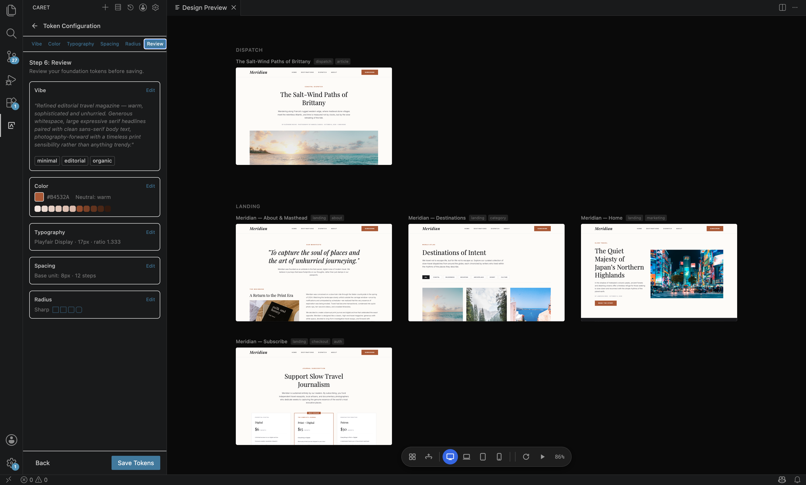

# Caret

**An AI design tool in your IDE — where design intent becomes running code.**

<p align="center">
  
</p>

Caret turns your editor into a design surface. You describe what you want, Caret generates real React pages into a standardized design layer, you arrange and edit them on a live canvas, and then sync that design straight into your application — in whatever framework your app actually uses.

It's built for the people shipping the product: solo developers, indie hackers, and small teams who design and build at the same time. The design layer is for the apps **you** create with Caret — not a separate Figma file to keep in sync, but design-as-code that lives in your repo and version-controls alongside your app.

---

## How it works

Caret splits your frontend into two layers that live in the same repo:

- A **design layer**, standardized to React and stored under `.caret/`. This is where you design — pages, flows, shared components, and design tokens. Think "Figma frames as code," version-controlled in parallel with your app.
- Your **application layer** — the app you actually ship, in any framework (React, Vue, Svelte, Angular, …). Caret stays unopinionated about it.

You design in the first layer, then sync into the second. The design layer's predictable structure is what unlocks the live canvas, visual editing, flow simulation, and design→app sync below.

---

### A standardized design layer

Everything you design lives under `.caret/` as plain React: pages in `.caret/pages/`, reusable pieces in `.caret/components/` and `.caret/layouts/`, navigation in `.caret/flows/`, and design tokens in `.caret/tokens/`. Each page carries a small `meta.json` describing its title, type, states, and tags. Because the design layer is always React with a known shape, Caret can reason about your pages reliably no matter what framework your shipped app uses.

### A token-driven design system

A guided wizard captures the foundations of your design system — a **vibe** descriptor, **color** (brand + neutral character + semantic), **typography** (Google Fonts + scale ratio), **spacing**, and **radius** — and shows a live preview of representative components updating as you tune each one. Pick the character, Caret generates the scale, you override what you want. The result is saved as namespaced JSON under `.caret/tokens/` and injected into generation so every page stays visually consistent.

### A live design canvas

All your pages render on a zoomable, pannable canvas — a Figma-style overview of the whole product. The focused page runs as live, interactive React; the rest show as cached thumbnails so the canvas stays fast even with many pages. Click any page to mount it live, switch viewport presets (desktop / tablet / mobile) to check responsiveness, and pan back out to see how everything fits together.

### Visual editing

Edit the rendered UI directly. Right-click an element to change its **text**, **color**, or **image** inline — the change is written back to the exact line of source and reflected instantly via hot-reload, no AI round-trip needed. For anything structural, choose **"Edit with AI"**: Caret hands the model rich context about the element (its source location, component, and props) and applies the change. Element targeting is deterministic via stable `data-caret-id` attributes and AST-level source edits, so edits land precisely instead of guessing.

### Flows and simulation

Define user journeys as flow graphs in `.caret/flows/*.flow.json`, referencing pages by ID. Overlay flow connections on the canvas to see how pages link together, restructure a flow by dragging an edge (Caret offers to update the underlying navigation to match), and enter **simulation mode** to click through your app in a device frame as a real user would — jumping between page states (empty, loading, error, success) with a state selector.

### Design → app sync

When the design is ready, sync it into your real app. Caret tracks design changes against a git-based bookmark in `.caret/sync-state.json`, reads the current state of both layers, and produces a reviewable plan covering the UI translation plus any state, routing, or data changes the design implies. You review and accept; Caret applies the changes and advances the bookmark. Sync is one-way (design → app) and reversible — an undo restores your app files and rewinds the bookmark.

---

## Also a full coding agent

Caret is built on the open-source [Cline](https://github.com/cline/cline) coding agent, so beyond design it's a complete autonomous coding assistant: bring any API and model, run terminal commands, create and edit files with reviewable diffs, drive a browser, extend itself with Model Context Protocol (MCP) tools, and roll back to checkpoints — all human-in-the-loop, with you approving each step.

## Getting started

Caret is a VS Code extension. To run it from source:

```bash
npm install
npm run compile
```

Then launch the extension from VS Code (Run → Start Debugging) to open a development host with Caret loaded. A packaged release and marketplace listing are coming as Caret matures.

## Contributing

Contributions are welcome — see the [Contributing Guide](CONTRIBUTING.md) to get started.

## License

[Apache 2.0](./LICENSE)
